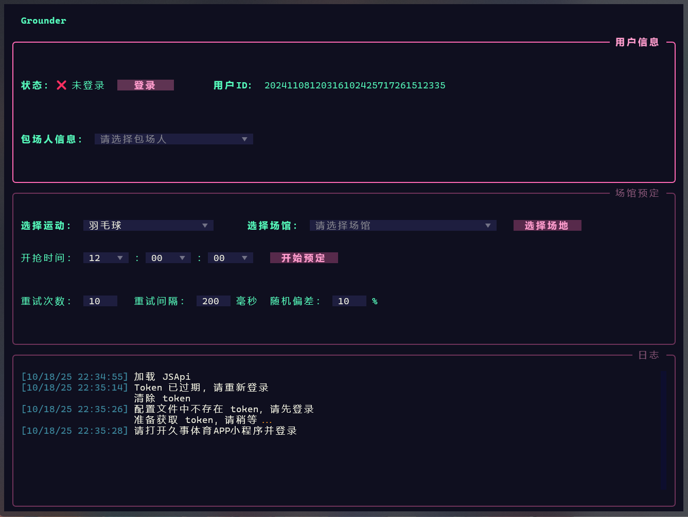
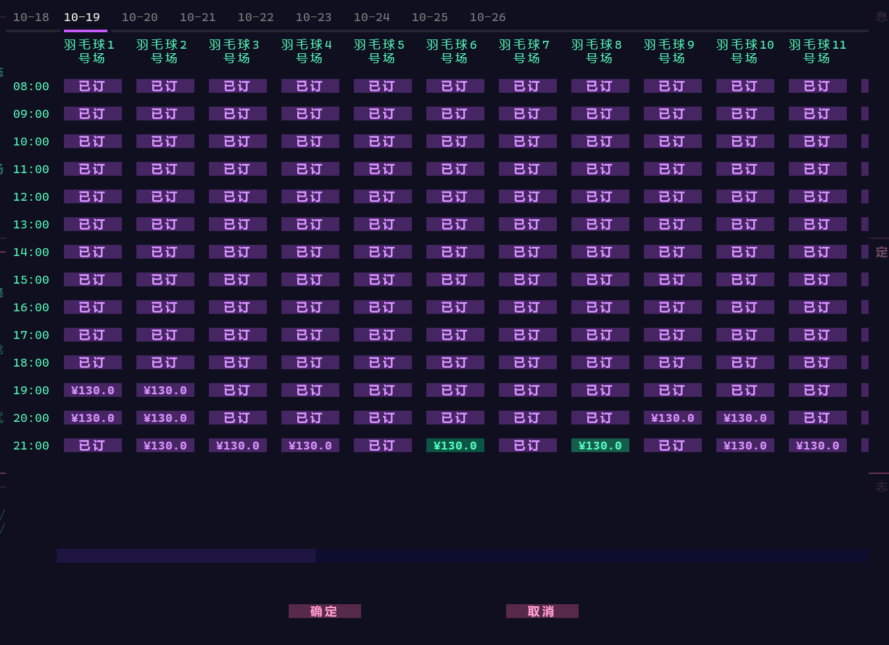

#

    
    
    <h1> Grounder </h1>
    久事体育订场辅助工具

## 下载地址 📥

[Github 下载](https://github.com/XIGUAjuice/Grounder/releases)

## 使用说明 🛠️

### 1. 安装依赖 📦

1. 请先安装依赖 [node.js](https://nodejs.org/zh-cn/download)
2. 强烈建议使用 [Windows Terminal](https://apps.microsoft.com/detail/9n0dx20hk701?hl=zh-CN&gl=CN) 运行程序获得更好的视觉效果
3. 首次使用请以管理员身份运行，需要安装证书

### 2. 登录 🔐

根据提示打开 [微信PC客户端](https://weixin.qq.com/)，打开“久事体育”小程序并登录（如果已经登陆就随便点两下），程序会自动获取 token。
当提示获取到 token 之后就可以关闭小程序了。

> 注意, 在手机或者其他地方再次打开小程序会使 token 失效，需要重新登录

### 3. 订场 🏟️

1. 登录之后选择包场人信息
2. 选择运动之后，选择场馆
3. 点击 「选择场地」，选择需要预定的场地，点击「确定」
    
4. 设置开抢时间和重试参数后，点击 「开始预定」，到时间后会自动下订单
5. 抢到场地之后会提示去微信小程序付款

> 注意：
> 1. 不要抢最后一天的场地，最后一天的场地是不开放预定的，显示已订的是场馆内定预留的
> 2. 不要把开抢时间设置在官方设定的开抢时间(羽毛球是中午 12 点)之前
> 3. 不要把重试间隔设置得很短，一般不需要改动，适当增加重试次数即可
> 4. 存在被久事体育封号风险，尽量使用小号

## 免责声明 ⚠️

> 严禁使用本程序倒卖场馆资源！！！

本项目遵循 MIT License 许可协议，仅供个人学习与研究使用。请勿将本项目用于任何商业牟利行为，亦严禁用于任何形式的代抢、违法行为或违反相关平台规则的用途。由此产生的一切后果均由使用者自行承担，与本人无关。

若您 fork 或使用本项目，请务必遵守相关法律法规与目标平台规则。

## 关于访问频率与并发控制 ⏱️

本项目在设计时严格遵循「非侵入式」原则，避免对目标服务器造成任何干扰。

所有网络请求的时间间隔均由用户自行配置，默认值模拟正常用户的手动操作速度。遇到请求失败时，程序会进行有限次数的重试，并在重试之间加入适当的延时，避免形成高频打点。项目完全依赖平台公开接口及网页结构，不含风控规避、API劫持等破坏性手段。

## 平台尊重声明 🤝

本程序设计时已尽可能控制请求频率，避免对「久事体育」服务器造成任何明显负载或影响。项目仅作为学习用途，不具备大规模、高并发的能力，亦无任何恶意行为或干扰服务的企图。

如本项目中存在侵犯「久事体育」公司合法权益的内容，请通过邮箱 [2530671370@qq.com](mailto:2530671370@qq.com) 与我联系，我将第一时间下架相关内容并删除本仓库。对此造成的不便，我深表歉意，感谢您的理解与包容。

## LICENSE 📄

本项目遵循 MIT 许可协议。http://www.opensource.org/licenses/mit-license